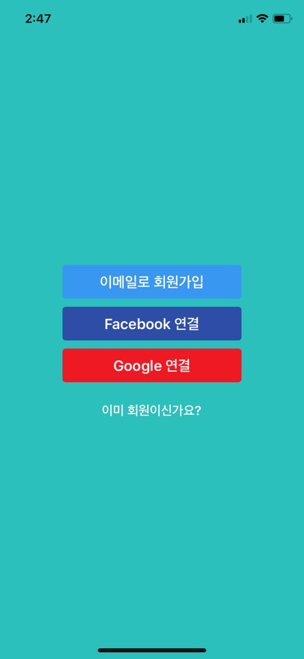

# 취준모아 iOS & Android App

## 📖 취준모아란?
취업준비생들은 대학생이나 직장인보다 집에 있는 시간이 많으며 사람들과 어울려 활동하기가 힘듭니다. 또 스터디원을 구하는것도 힘들어 혼자서 방황할때가 많습니다. 이러한 취준생들의 고민을 해결하기 위해 만든 앱이 바로 취준모아 앱입니다.   
스터디를 등록하고, 또 다른사람들이 모집하는 스터디를 보고 함께 참여할 수 있고 또 여러가지 취미모임도 생성하고 가입하고 새로운 사람들과 활동하면서 취업으로 인한 스트레스를 풀 수 있도록 도와주기 위해 개발하게 되었습니다.  

## 취준모아 스크린샷
### 👩‍💻 회원가입 및 로그인 

    
    
    
    

### 🏠 홈화면 
취업준비생들에게 도움을 줄 수 있는 포스트들이 나오도록 구현 ( 취업준비생들에게 좋은 음식, 공모전 소식 등)

    

### 📕 스터디화면
회원들이 모집하는 스터디를 확인할 수 있으며, 스터디 종류별 정렬을 통하여 자신이 원하는 스터디를 찾아서 활동할 수 있게끔 구현했으며 자신의 스터디라면 삭제 또는 수정 또는 모집마감 할 수 있게끔 구현

    
    
    

